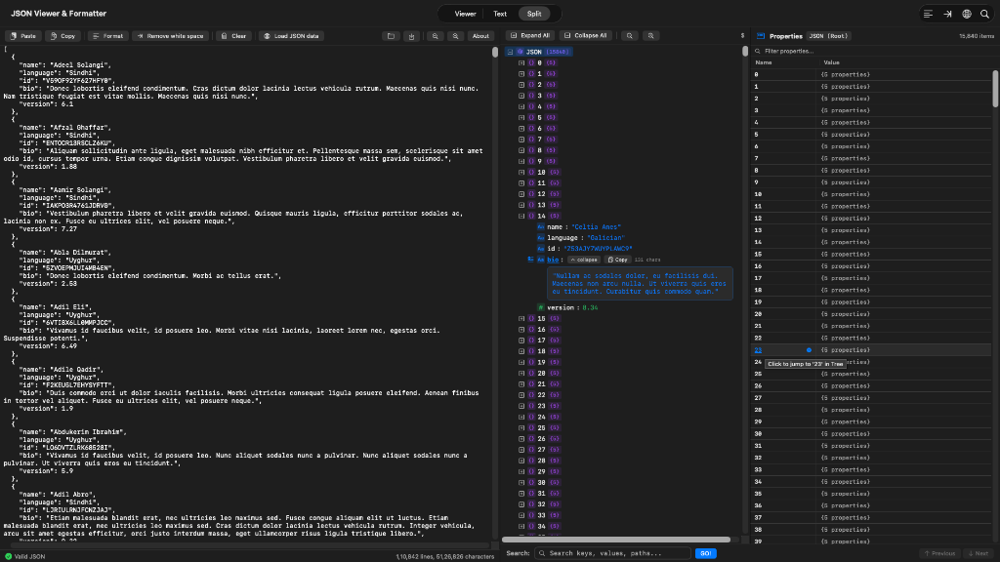
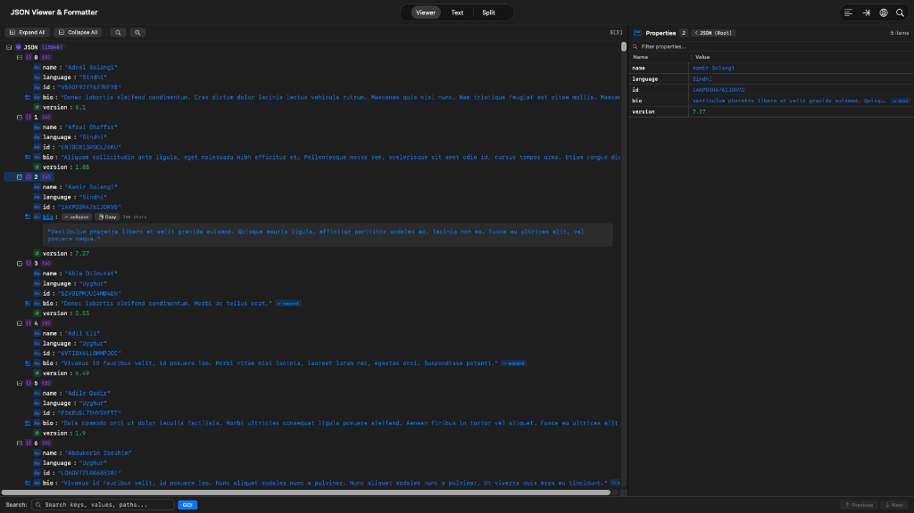
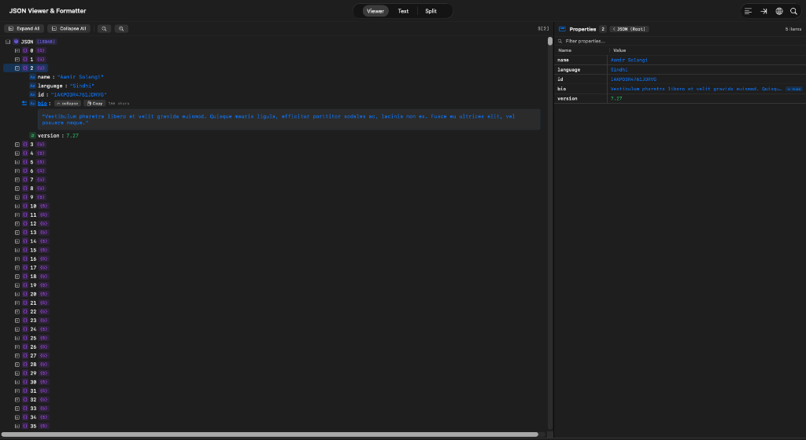
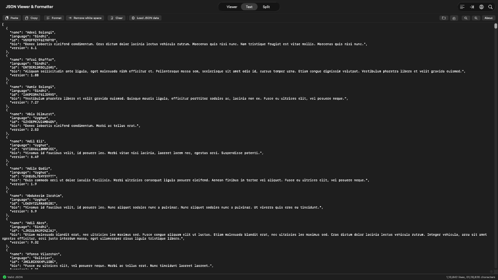

# JSON Viewer for macOS

<p align="center">
  
  <br />
  <b>A fast, lightweight, native macOS application recreating and elevating the classic online <a href="https://jsonviewer.stack.hu/">JSON Viewer and Formatter (jsonviewer.stack.hu)</a>.</b>
  <br /><br />
  
  
  
  
  
</p>

---

## 📸 Overview & Split Mode

Experience real-time JSON editing and hierarchical exploration side-by-side:

<p align="center">
  
  <em>Split Mode: Monospace Editor (left), Tree Hierarchy with full-width expanded text (center), and Interactive Property Inspector with jump navigation (right).</em>
</p>

---

## ✨ Features & Walkthrough

### 1. Hierarchical Tree Viewer with Expandable Full-Width Text
Explore deep JSON structures with collapsible nodes, color-coded type badges, and dynamic full-width multi-line textareas for large text fields:

<p align="center">
  
</p>

- 🏷️ **Type Badges matching `jsonviewer.stack.hu`**:
  - 🔵 **String** (`key : "value"`)
  - 🟢 **Number** (`key : 123`)
  - 🟡 **Boolean** (`key : true`)
  - 🔴 **Null** (`key : null`)
  - 🟣 **Object / Array** (`key {N}` / `key [N]`)
- 📖 **Expandable Big Text**:
  - Automatic detection for long strings (> 40 characters or newlines).
  - Visual cue badge `[ ▾ expand ]` and `text.badge.plus` icon.
  - **Full-Width Responsive Textarea**: Stretches across the full width of the tree panel and wraps smoothly.
  - Includes a quick **Copy** button with animated "Copied!" confirmation, character count badge, and native text selection (`.textSelection(.enabled)`).
- 🖱️ **Context Menus**: Right-click any tree node to *Expand*, *Expand All*, *Collapse*, *Collapse All*, *Copy Value*, *Copy Key*, *Copy JSON Path* (e.g. `$.users[0].address.city`), or *Copy Subtree as JSON*.

---

### 2. Interactive Property Inspector & Jump Navigation
Inspect element properties in a 2-column table with click-to-jump tree synchronization:

<p align="center">
  
</p>

- 🔗 **Clickable Property Names**: Clicking on any property name in the grid (e.g. `23` or `name`) instantly jumps to, selects, and scrolls to that element in the tree.
- ⚡ **Auto-Reveal**: Ancestor nodes of target items are automatically unfolded in the tree view.
- 🧭 **Breadcrumb Navigation**: Header back button `[ < Parent ]` allows easy navigation back up the object tree.
- 🔍 **In-Grid Search Filter**: Quickly filter through thousands of properties in large objects.
- 📐 **Expandable Grid Values**: Built-in `[ ▾ more ]` / `[ ▴ less ]` toggles for long values within grid cells.

---

### 3. Native Text Editor & 2-Space Formatter
A full-featured code editor with instant syntax feedback:

<p align="center">
  
</p>

- ⚡ **Classic Web Toolbar Actions**:
  - **Paste / Copy**: Fast clipboard integration.
  - **Format**: Prettifies JSON using standard **2-space indentation** matching `jsonviewer.stack.hu`.
  - **Remove white space**: High-speed minification preserving string literals.
  - **Clear**: Clears text buffer.
  - **Load JSON data**: Remote URL dialog with built-in presets (GitHub API, HTTPBin, Mock Data).
- 🛡️ **Syntax Validation**: Real-time error detection reporting exact line and column numbers.
- 📊 **Status Bar**: Real-time line and character counter.
- 📁 **Native macOS File Handling**: Open (`Cmd+O`) and Save (`Cmd+S`) `.json` files.

---

## ⚡ Performance & Scale

- **Virtualized Rendering**: High-performance lazy row rendering capable of smoothly navigating datasets with **15,840+ items** and 5MB+ payloads with zero UI lag.
- **Pure Swift Engine**: Zero third-party runtime dependencies; built exclusively with AppKit and SwiftUI.

## 📦 Installation (Pre-built App)

1. Download **`JSONViewer-macOS.zip`** from the [GitHub Releases](../../releases).
2. Double-click the downloaded `.zip` file to extract **`JSONViewer.app`**.
3. Drag **`JSONViewer.app`** into your `/Applications` folder.

> [!NOTE]
> **First-time Opening on macOS (Gatekeeper)**:
> Since this is an open-source application without an Apple Developer ID certificate:
> - **Right-click** (or Control-click) `JSONViewer.app` and select **Open**, then click **Open** in the prompt.
> - *Alternatively*, run this command once in Terminal:
>   ```bash
>   xattr -cr /Applications/JSONViewer.app
>   ```

---

## 🚀 Building and Running from Source

### Prerequisites
- macOS 13.0 (Ventura) or later
- Xcode Command Line Tools (`xcode-select --install`)

### Quick Run via Swift PM
```bash
swift run
```

### Build & Install to `/Applications`
```bash
./build_app.sh install
```
This compiles the release binary, creates the iconset, code-signs the app, installs it to `/Applications/JSONViewer.app`, and launches it.

### Build macOS App Bundle
```bash
./build_app.sh run
```
This builds `build/JSONViewer.app` and launches it directly from the build folder.

### Run Automated Test Suite (62 Tests)
```bash
swift run JSONViewerTests
```

---

## ⌨️ Keyboard Shortcuts

| Shortcut | Action |
| :--- | :--- |
| <kbd>⌘</kbd> <kbd>⇧</kbd> <kbd>F</kbd> | Format / Pretty Print JSON (2 spaces) |
| <kbd>⌘</kbd> <kbd>⇧</kbd> <kbd>M</kbd> | Remove White Space / Minify |
| <kbd>⌘</kbd> <kbd>K</kbd> | Clear Editor |
| <kbd>⌘</kbd> <kbd>L</kbd> | Load JSON from URL |
| <kbd>⌘</kbd> <kbd>F</kbd> | Focus Search Bar / Find |
| <kbd>Enter</kbd> | Find Next Match (in Search Field) |
| <kbd>⇧</kbd> <kbd>Enter</kbd> | Find Previous Match / Reverse (in Search Field) |
| <kbd>⌘</kbd> <kbd>G</kbd> | Find Next Match |
| <kbd>⌘</kbd> <kbd>⇧</kbd> <kbd>G</kbd> | Find Previous Match |
| <kbd>⌘</kbd> <kbd>E</kbd> | Expand All Tree Nodes |
| <kbd>⌘</kbd> <kbd>⇧</kbd> <kbd>E</kbd> | Collapse All Tree Nodes |
| <kbd>⌘</kbd> <kbd>+</kbd> | Zoom In Font Size |
| <kbd>⌘</kbd> <kbd>-</kbd> | Zoom Out Font Size |
| <kbd>⌘</kbd> <kbd>O</kbd> | Open JSON File |
| <kbd>⌘</kbd> <kbd>S</kbd> | Save JSON File |

---

## 📜 Credits
Inspired by the original online JSON Viewer and Formatter by [Gabor Turi](https://jsonviewer.stack.hu/).  
Rebuilt natively for macOS in modern Swift.

